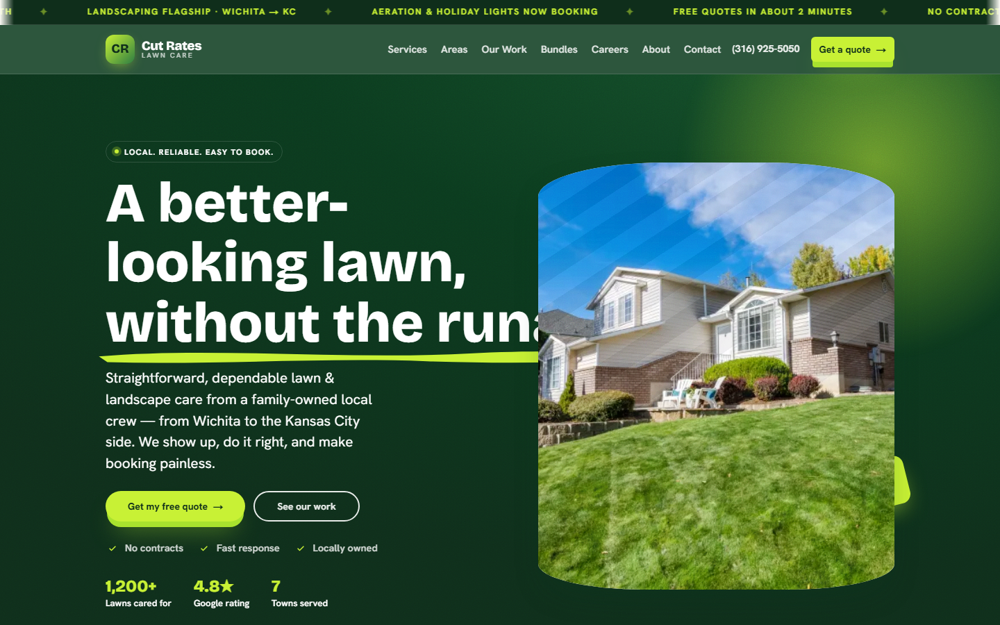
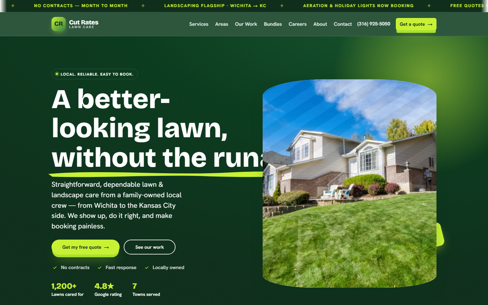
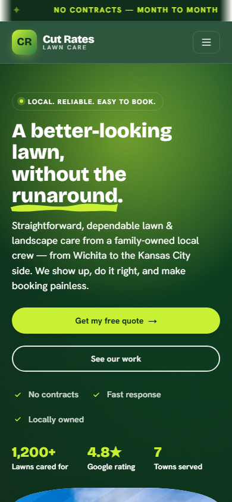
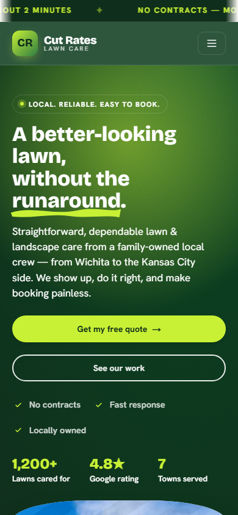

# Homepage-only preview deployment

**Status:** Live and validated (2026-08-29)  
**Subdomain used:** `https://new.cutrateslawn.com/`  
**One line:** Homepage-only preview on the real domain, matching the finished homepage exactly — no other pages live yet. Not the production launch.

---

## Final URL

| Surface | URL |
|---------|-----|
| **Preview (canonical for this milestone)** | https://new.cutrateslawn.com/ |
| Vercel production alias | https://cutrates-homepage-preview.vercel.app |
| Latest deployment | https://cutrates-homepage-preview-a4huu0vmc-xoate0100s-projects.vercel.app |

---

## Source commit (parity target)

| Item | SHA / ref |
|------|-----------|
| **d7d7wkfp live deploy (GitHub Production)** | `84ef9bae212879a33cb363b9c8fc1ba32e1246d1` |
| Message | Merge pull request #3 from xoate0100/ratchet-4.15.0 |
| Deployed | 2026-08-27 (Vercel project `v0-cut-rates-lawn-main-page`, deployment `dpl_GbauJyvMc1qfLgMSn3yRshcJ6Jfz`) |
| **Preview branch base** | Same commit (`84ef9ba`) |
| **Preview branch tip** | `34a737c` — homepage-only nav neutralization + middleware redirects + `noindex` |

### Drift vs current `main`

At deploy time, `origin/main` was also at `84ef9ba`. **Homepage markup/content is unchanged** between d7d7wkfp and this preview except for:

- `noindex,nofollow` meta
- Nav/CTA handlers (scroll or quote-soon toast instead of routing)
- Middleware redirects for non-`/` paths

No redesign or copy changes were made to homepage sections.

---

## Isolated infrastructure

| Item | Value |
|------|--------|
| Git branch | `preview/homepage-only` (not merged to `main`) |
| Vercel project | **`cutrates-homepage-preview`** (`prj_l5Zqg5OrVFcgpsbjUJyRmPJwA5cX`) |
| Deployment inspector | https://vercel.com/xoate0100s-projects/cutrates-homepage-preview/7izfPUAx5uibCSA3ur9XD644cEwC |
| Untouched | `main`, `v0-cut-rates-lawn-main-page`, `d7d7wkfp.cutrateslawn.com`, apex `cutrateslawn.com`, `www` |

---

## Cloudflare DNS

Created on zone `cutrateslawn.com` (`573bafdaab60256c62329bf4090690a0`):

| Type | Name | Target | Proxy |
|------|------|--------|-------|
| **CNAME** | `new` | `afb09391f4530739.vercel-dns-017.com` | **DNS only** (grey cloud) |

**Subdomain selection:** `new.cutrateslawn.com` was chosen first — no prior explicit DNS record existed (wildcard previously routed to WordPress). `preview`, `redesign`, and `staging2` also had no explicit records; `new` was provisioned first per fallback order.

SSL: HTTPS verified after CNAME propagation (~30–60s).

---

## What shipped on the preview branch

- **Middleware:** all non-home routes → `307` redirect to `/`
- **Header/footer/hero/quote band/bundles/live chat:** same visuals; links scroll in-page or show *“Quotes launching soon — call/text (316) 925-5050.”*
- **Tel/mailto:** still functional
- **`<meta name="robots" content="noindex,nofollow">`** + `robots: { index: false }` in metadata
- **Media:** unchanged `getMedia(slot)` / fallbacks pipeline

---

## Validation checklist

| Check | Result |
|-------|--------|
| `GET /` over HTTPS | **200** |
| `GET /quote` | **307 → /** |
| `GET /services` | **307 → /** |
| `GET /about` | **307 → /** |
| `noindex,nofollow` in HTML | **Present** |
| Hero headline “A better-looking lawn…” | **Present** on both URLs |
| Desktop 1440px | **OK** (screenshots below) |
| Mobile 390px | **OK** (screenshots below) |
| Console errors (spot check) | **None observed** during fetch |

---

## Visual parity — side by side

Screenshots captured 2026-08-29 (`pnpm exec node scripts/capture-homepage-preview.mjs`):

### Desktop (1440×900 viewport)

| d7d7wkfp (reference) | new.cutrateslawn.com (preview) |
|----------------------|--------------------------------|
|  |  |

### Mobile (390×844 viewport)

| d7d7wkfp (reference) | new.cutrateslawn.com (preview) |
|----------------------|--------------------------------|
|  |  |

**Verdict:** Hero, header, marquee, typography, and layout match. Only expected differences are non-navigating CTAs (behavioral, not visual).

---

## Re-run capture

```bash
pnpm exec node scripts/capture-homepage-preview.mjs
```

Outputs to `docs/redesign/screenshots/homepage-preview/`.
